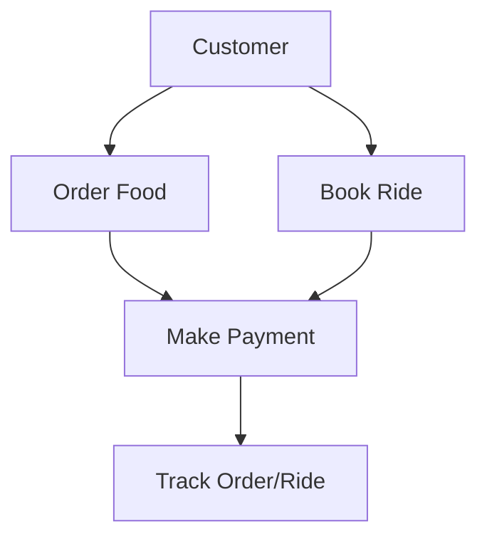

<h1>👋 Hi, I’m @Minn01 or real name (Min Thant)</h1>

- Currently a third year studying at Thailand of an IT major
- I’m currently learning python, java, HTML, CSS and Javascript (React), Kotlin, Swift, Rust

<h3 align="left">Connect with me:</h3>

  

<h3 align="left">Languages and Tools:</h3>

                 

&nbsp;

  

# Hi there, I'm [Your Name]! 👋

  

## 🚀 About Me

- 🔭 I'm currently working on **Grab Use Case Diagram Project**
- 🌱 I'm currently learning **System Design & UML**
- 👯 I'm looking to collaborate on **Open Source Projects**
- 💬 Ask me about **Web Development, Mobile Apps**
- 📫 How to reach me: **your.email@example.com**
- ⚡ Fun fact: **I debug with console.log() and I'm proud of it!**

 

## 🛠️ Languages and Tools

## 📊 GitHub Stats

  

## 🏆 GitHub Trophies

  

## 📈 Activity Graph

  

## 🎯 Current Projects

### 📱 Grab Use Case Diagram Analysis
> **IN542 - Software Engineering Project**
> 
> 🔍 Reverse engineering Grab app functionality  
> 📋 Creating comprehensive use case diagrams  
> 🎨 Implementing UML best practices  
> 
> **Tech:** UML Diagrams, System Design, Software Analysis

## 🐱‍💻 Coding Activity

<!--START_SECTION:waka-->
<!--END_SECTION:waka-->

## 🤝 Connect with me

## 💡 Random Quote

  

---

### Show some ❤️ by starring some of my repositories!

<!-- Animated SVG Wave -->

